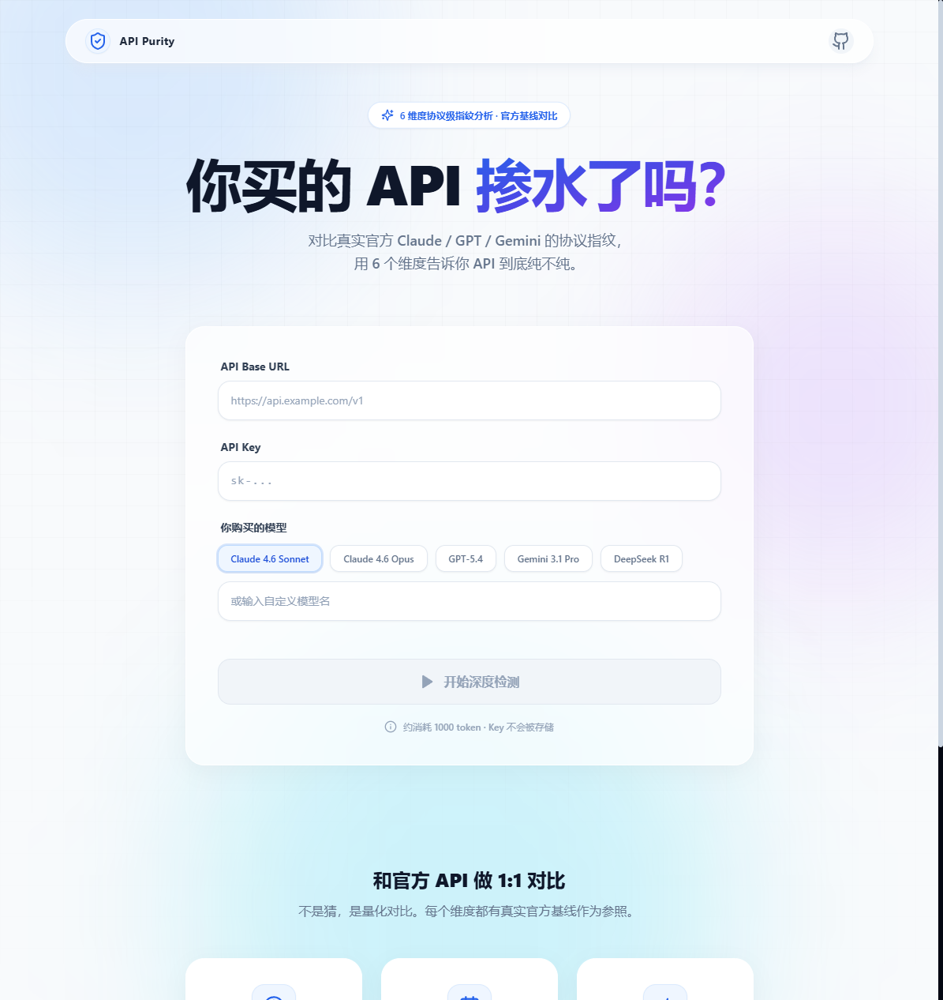

# API 纯净度检测器

> 你买的 API 掺水了吗？用 6 个维度对比官方基线，告诉你 API 到底纯不纯。

<p align="center">
  
</p>

## 在线体验

🌐 **[https://detect.713812.xyz](https://detect.713812.xyz)** — 无需部署，直接使用

<p align="center">
  
</p>

## 工作原理

与传统的「问几道题」式检测不同，本工具采用 **协议级指纹分析**，将被测 API 与**真实官方 API 的已知行为基线**做 1:1 对比。

检测算法参考了 [BridgeBench](https://www.bridgebench.ai/) 的多维度评测方法论：通过推理准确率、代码生成质量、响应一致性等维度建立可量化的模型能力指纹，据此判断 API 服务是否存在模型替换。

### 基线数据来源

我们的检测基线参考了 BridgeBench 2026 年 4 月的公开评测数据：

| 模型 | 推理 | 代码算法 | 调试 | 安全 | 速度 (tok/s) |
|------|------|---------|------|------|-------------|
| Claude Sonnet 4.6 | 37.2 | — | 86.6 | 85.3 | 95.3 |
| Claude Opus 4.6 | 39.6 | — | 87.0 | 81.6 | 92.2 |
| GPT-5.4 | 40.6 | 98.9 | 85.6 | 84.4 | — |
| Gemini 3.1 Pro | 34.3 | — | 85.9 | 85.2 | 122.2 |
| Grok 4.20 Reasoning | 41.8 | — | 85.3 | 78.9 | 237.7 |

> 数据来源：[BridgeBench AI Coding Benchmark](https://www.bridgebench.ai/) · 2026-04-14

每个模型在各维度都有独特的能力指纹。例如 Claude Sonnet 4.6 的推理分 37.2 和调试分 86.6 构成了其特征签名，如果中转站用 GLM 或 Qwen 冒充，这些维度的偏差会立即暴露。

### 6 大检测维度

| 维度 | 满分 | 检测内容 | 为什么有效 |
|------|------|---------|-----------|
| **SSE 协议指纹** | 100 | 流式响应的 SSE 事件链结构 | 官方 Anthropic 有独特的 `message_start → content_block_start → content_block_delta → message_delta → message_stop` 完整事件链，掺水站很难完美伪造 |
| **模型身份验证** | 100 | 返回头 model 字段 + 自我声明 | 官方 API 会在 HTTP 返回头中标识正确模型名，且模型能正确自我介绍身份 |
| **知识截止验证** | 100 | 训练数据截止时间 | 每个模型版本有固定的知识截止日期（如 Claude 4.6 = 2025 年 5 月），替换模型会暴露不同日期 |
| **推理能力基线** | 100 | 数学陷阱 + 逻辑推理 | 参考 BridgeBench Reasoning 基线，高端模型（Claude 4.6/GPT-5.4）的基础推理正确率 100%，低端替代模型做不到 |
| **代码生成质量** | 100 | 类型标注/边界处理/算法优化 | 参考 BridgeBench Algorithms & Generation 基线，官方高端模型的代码质量有已知特征 |
| **响应一致性** | 100 | 多次请求的模型标识和延迟 | 参考 BridgeBench Speed 基线，正规 API 的延迟和吞吐量应在已知范围内 |

### 综合评定

- **检测通过** — 各项维度均与官方基线匹配
- **轻微异常** — 多个维度存在偏差（可能是版本差异）
- **存在可疑** — 某维度严重异常
- **高度疑似掺水** — 2 个以上维度严重不达标

## 快速使用

```bash
# 克隆并安装
git clone https://github.com/Forlives/relay-api-hub.git
cd relay-api-hub
npm install

# 启动（前后端同时）
npm run dev
```

打开 `http://localhost:5173`，输入你的 API 地址、Key 和购买的模型，点击「开始深度检测」。

## 隐私安全

- API Key **不会被存储**，仅在检测过程中临时使用
- 后端完全 **无状态**，不记录任何日志
- 所有检测请求都在你的 **本地服务器** 发出
- 在线版同样遵守以上原则

## 技术栈

**前端**: React 18 + TypeScript + Tailwind CSS + Framer Motion
**后端**: Node.js + Express（无状态）

## 支持的模型家族

| 家族 | 示例模型 | 检测维度 |
|------|---------|---------|
| Claude (Anthropic) | claude-sonnet-4-6, claude-opus-4-6 | 全部 6 维度（含 SSE 协议指纹） |
| GPT (OpenAI) | gpt-5.4 | 5 维度（SSE 指纹不适用） |
| Gemini (Google) | gemini-3.1-pro | 5 维度 |
| DeepSeek | deepseek-r1 | 5 维度 |

## API

```
POST /api/detect
{
  "api_base": "https://api.example.com/v1",
  "api_key": "sk-...",
  "model": "claude-sonnet-4-6-20250514"
}
```

返回 6 维度的详细分数、官方基线对比和综合评定结果。

## 参考

- [BridgeBench — AI Coding & Vibe Coding Benchmark](https://www.bridgebench.ai/) — 多维度 AI 模型能力评测基准
- [Anthropic API Reference](https://docs.anthropic.com/) — Claude SSE 流式协议规范
- [OpenAI API Reference](https://platform.openai.com/docs/) — GPT 系列 API 行为基线

## License

MIT
